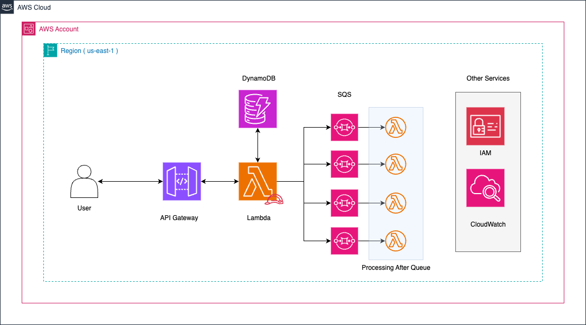

# 🚀 Solución: Directo a SQS

## 📌 Descripción  
Esta solución implementa un **microservicio serverless** en AWS que recibe órdenes de trabajo y las procesa de manera eficiente utilizando **AWS API Gateway, AWS Lambda, Amazon DynamoDB y Amazon SQS**.  

📌 **Objetivo**:  
- Exponer un endpoint REST para recibir órdenes de trabajo.  
- Validar los datos y almacenarlos en DynamoDB.  
- Enviar las órdenes a una **cola SQS específica** según su estado.  
- Permitir el consumo y procesamiento posterior desde SQS.  

---

## 🏗️ Arquitectura  

La arquitectura sigue un modelo **event-driven**, donde cada componente está desacoplado para mayor escalabilidad y resiliencia.  

📌 **Servicios utilizados**:  
- **Amazon API Gateway** → Expone el endpoint REST.  
- **AWS Lambda** → Procesa las órdenes, valida los datos y las envía a SQS.  
- **Amazon DynamoDB** → Almacena las órdenes de trabajo con una estructura NoSQL optimizada.  
- **Amazon SQS (FIFO)** → Garantiza la entrega ordenada y permite el procesamiento asíncrono.  

📌 **Flujo de la solución**:  
1. **El cliente envía una solicitud POST** a API Gateway con los datos de la orden.  
2. **API Gateway invoca la función Lambda**, que valida la información.  
3. **La orden se almacena en DynamoDB** con su estado y metadatos.  
4. **Lambda envía la orden a la cola SQS correspondiente**, garantizando el orden de llegada si se usa **SQS FIFO**.  
5. **Un worker Lambda puede consumir los mensajes de SQS** y procesar las órdenes en el backend.  

📌 **Diagrama de Arquitectura**:  
  

---

## ✅ Ventajas de esta solución  
✔ **Baja latencia**: La API responde rápido porque la lógica es sencilla.  
✔ **Escalable**: SQS maneja alto tráfico sin comprometer la API.  
✔ **Simplicidad**: Es fácil de implementar y mantener.  
✔ **Orden garantizado con SQS FIFO**: Asegura que las órdenes se procesen en el orden en que llegaron.  

---

## ❌ Desventajas y Limitaciones   
❌ **No es ideal para múltiples consumidores**: Si varias aplicaciones deben recibir eventos, **SNS + Filtering** es una mejor opción.  
❌ **Costo de SQS FIFO**: Es un poco más costoso que SQS estándar debido a las garantías de orden.  

---

## 🚀 Despliegue  
Para desplegar esta solución en AWS, puedes usar **Serverless Framework** con el archivo `serverless.yml`:  

### 📌 **Instalar dependencias**  
```sh
npm install -g serverless
```

Si es la primera vez que usas Serverless Framework, asegúrate de configurar tus credenciales de AWS:

```sh
cd solutions/direct-to-sqs
serverless deploy --stage dev
```

### 📌 Importante:
Para desplegar esta solución, debes tener:
✔ AWS CLI instalado y configurado (aws configure).
✔ Un perfil AWS con permisos administrativos para crear recursos en API Gateway, Lambda, DynamoDB y SQS.

🚀 Desplegar la solución
Para desplegar la solución Direct-to-SQS, ejecuta:


```sh
cd solutions/direct-to-sqs
serverless deploy --stage dev
```

Esto creará los siguientes recursos en AWS:
✔ API Gateway para exponer el endpoint REST.
✔ Función AWS Lambda para validar y procesar órdenes.
✔ DynamoDB para almacenar las órdenes.
✔ SQS FIFO para garantizar el procesamiento en orden.

📌 Una vez desplegado, Serverless Framework imprimirá la URL del endpoint API Gateway.

