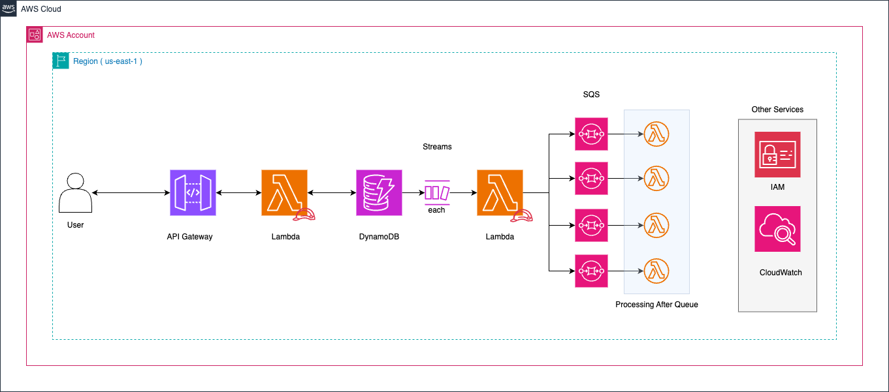

# 🚀 Solución: DynamoDB Streams

## 📌 Descripción  
Esta solución implementa un **microservicio serverless** en AWS que utiliza **DynamoDB Streams** para reaccionar a cambios en la base de datos y enviar las órdenes de trabajo a una cola SQS.  

### Objetivo:  
- Recibir órdenes de trabajo mediante un endpoint REST.  
- Validar y almacenar las órdenes en **Amazon DynamoDB**.  
- Usar **DynamoDB Streams** para detectar inserciones/modificaciones y enviar eventos a una cola **SQS** para su posterior procesamiento.

---

## 🏗️ Arquitectura  

La arquitectura está compuesta por:

- **Amazon API Gateway**: Para exponer el endpoint REST.  
- **AWS Lambda (API Handler)**: Valida y almacena las órdenes en DynamoDB.  
- **Amazon DynamoDB**: Almacenamiento NoSQL de las órdenes.  
- **DynamoDB Streams**: Detecta los cambios en la tabla.  
- **AWS Lambda (Stream Handler)**: Procesa los registros del stream y envía mensajes a **Amazon SQS**.  
- **Amazon SQS (FIFO o Estándar)**: Cola de mensajes para procesamiento asíncrono.

El siguiente diagrama ilustra la arquitectura:



---

## ✅ Ventajas  
- **Desacoplamiento**: El procesamiento se realiza asíncronamente mediante el stream.  
- **Escalabilidad**: DynamoDB Streams y SQS permiten manejar grandes volúmenes de datos.  
- **Resiliencia**: La arquitectura tolera fallos en el procesamiento sin afectar la inserción en la base de datos.

---

## ❌ Desventajas  
- **Retraso en el procesamiento**: La propagación de eventos a través de Streams puede tener ligeros retrasos.  
- **Complejidad**: Requiere dos funciones Lambda y la configuración de DynamoDB Streams.

---

## 🚀 Despliegue  
Utiliza **Serverless Framework** para desplegar todos los recursos:

### Desplegar la solución  
```bash
cd solutions/dynamo-streams
serverless deploy --stage dev
