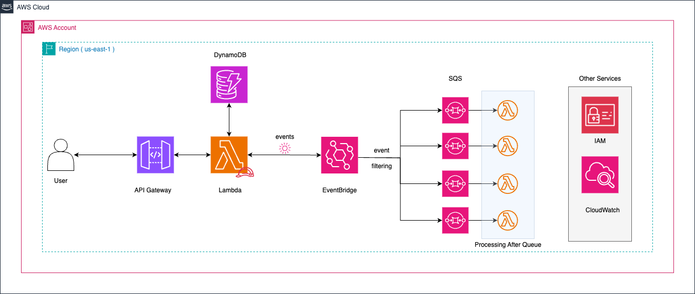

# 🚀 Solución: EventBridge a SQS

## 📌 Descripción  
Esta solución implementa un **microservicio serverless** en AWS que utiliza **EventBridge** para enrutar eventos a diferentes colas **SQS** según el estado de la orden de trabajo.

### Objetivo:  
- Recibir órdenes de trabajo mediante un endpoint REST.  
- Validar y almacenar las órdenes en **Amazon DynamoDB**.  
- Publicar eventos en **EventBridge** para ser enviados a la cola SQS correspondiente según el estado.

---

## 🏗️ Arquitectura  

La solución se compone de:

- **Amazon API Gateway**: Exposición del endpoint REST.  
- **AWS Lambda**: Valida, almacena en DynamoDB y publica eventos en EventBridge.  
- **Amazon DynamoDB**: Almacenamiento de órdenes de trabajo.  
- **Amazon EventBridge**: Enruta eventos a colas SQS basándose en reglas de eventos.  
- **Amazon SQS**: Recibe los eventos y los pone a disposición para su procesamiento asíncrono.

El siguiente diagrama muestra la arquitectura:



---

## ✅ Ventajas  
- **Enrutamiento flexible**: Permite reglas sofisticadas para direccionar eventos a distintas colas.  
- **Desacoplamiento**: Cada componente se puede escalar y actualizar de forma independiente.  
- **Monitoreo centralizado**: EventBridge facilita la gestión y el seguimiento de eventos.

---

## ❌ Desventajas  
- **Retrasos potenciales**: El enrutamiento a través de EventBridge puede introducir pequeñas latencias.

---

## 🚀 Despliegue  
Para desplegar esta solución, usa **Serverless Framework**:

```bash
cd solutions/eventbridge-sqs
serverless deploy --stage dev


