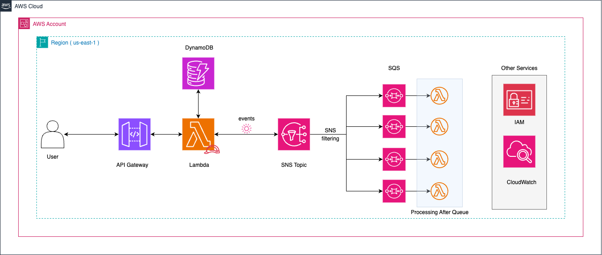

# 🚀 Solución: SNS Filtering

## 📌 Descripción  
Esta solución implementa un **microservicio serverless** en AWS que utiliza **SNS con filtrado de mensajes** para enrutar órdenes de trabajo a colas SQS específicas según el atributo `status`.

### Objetivo:  
- Recibir órdenes de trabajo mediante un endpoint REST.  
- Validar y almacenar las órdenes en **Amazon DynamoDB**.  
- Publicar eventos en un tópico **SNS** junto con atributos de filtrado.  
- Enviar los eventos a la cola SQS correspondiente mediante suscripciones con **Filter Policies**.

---

## 🏗️ Arquitectura  

La arquitectura se compone de:

- **Amazon API Gateway**: Exposición del endpoint REST.  
- **AWS Lambda**: Procesa la orden, la valida, la almacena en DynamoDB y publica un mensaje en SNS.  
- **Amazon DynamoDB**: Almacenamiento de las órdenes.  
- **Amazon SNS**: Publica eventos con atributos de filtrado.  
- **Amazon SQS**: Recibe los mensajes a través de suscripciones configuradas con Filter Policies.  
- **Políticas de Cola SQS**: Aseguran que SNS pueda enviar mensajes a cada cola.

El siguiente diagrama muestra la arquitectura:



---

## ✅ Ventajas  
- **Filtrado de mensajes nativo**: Permite enrutar mensajes a múltiples destinos según atributos.  
- **Escalabilidad**: SNS y SQS permiten alta concurrencia y tolerancia a fallos.  
- **Flexibilidad**: Fácil de agregar o modificar reglas de filtrado sin afectar la producción.

---

## ❌ Desventajas  
- **Configuración adicional**: Requiere definir políticas de acceso en SQS y configurar correctamente las suscripciones SNS.  

---

## 🚀 Despliegue  
Para desplegar esta solución, usa **Serverless Framework**:

```bash
cd solutions/sns-filtering
serverless deploy --stage dev